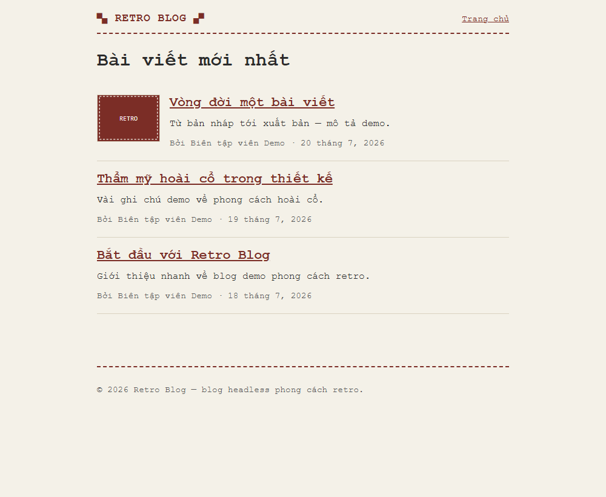
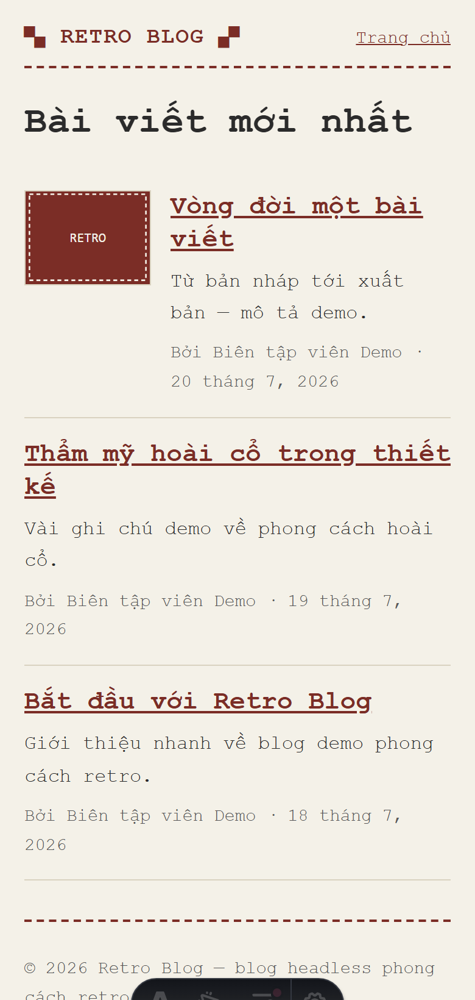
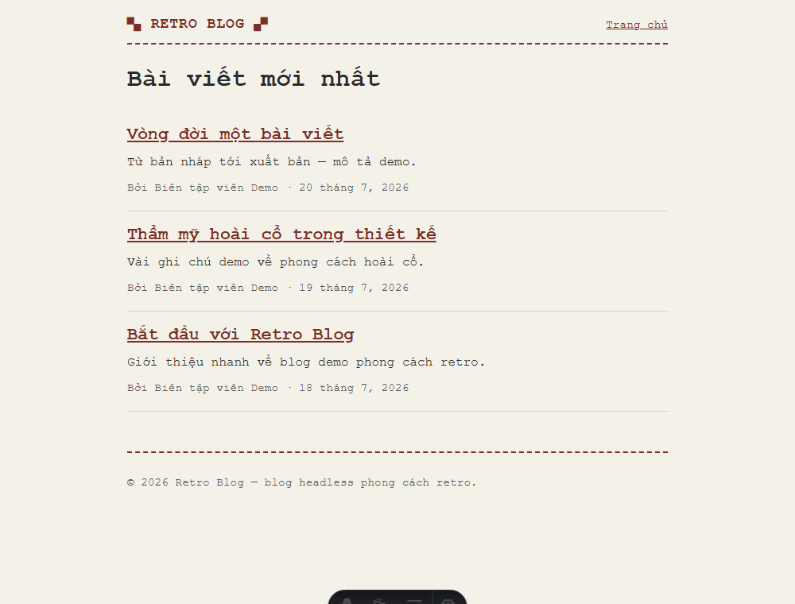

# Sprint 3 — Phase 2 (Homepage Post Card, Option B) — Ảnh giao diện

Chụp `2026-07-22` từ `astro dev`, dữ liệu seed dev.

| Ảnh | Ngữ cảnh | Ghi chú |
|---|---|---|
|  | Desktop 1000px — **mixed** | Card đầu có **thumbnail hỗ trợ** (nhỏ, trái); 2 card sau **text-only** (bài không cover) |
|  | Mobile 390px (DPR 2) | Thumbnail vẫn nhỏ-trái (hỗ trợ); text wrap, **không overflow ngang** (đo CDP: scrollWidth = innerWidth = 390) |
|  | Desktop — **toàn bộ không cover** | Chứng minh card **cân đối khi bỏ hết thumbnail** (điều chỉnh 3) |

> Ảnh bìa demo chỉ gắn tạm để minh hoạ trạng thái *mixed*, **đã gỡ** sau khi chụp — seed dev giữ đúng spec (0 cover). Thumbnail đóng vai trò **hỗ trợ**, không cover ⇒ tự chuyển text-only, **không placeholder**.
