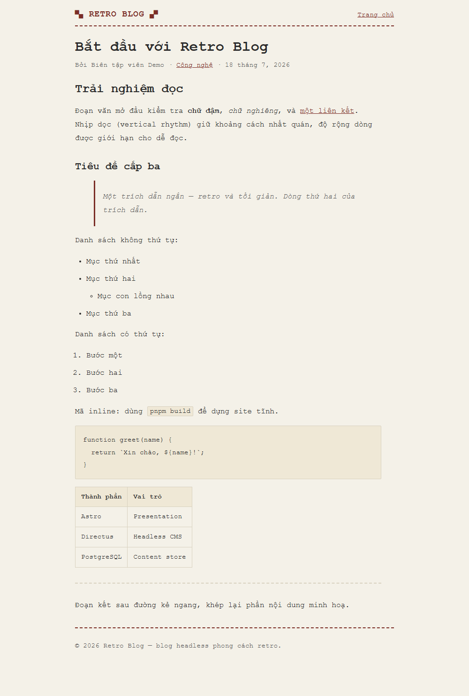
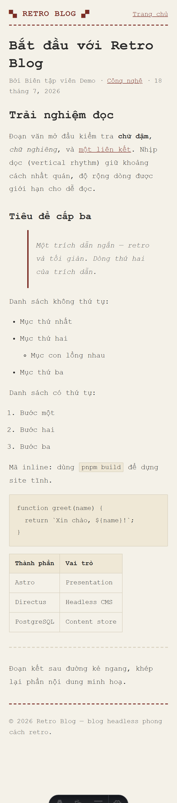

# Sprint 3 — Phase 3 (Post Detail Reading Experience) — Ảnh giao diện

Chụp `2026-07-22` từ `astro dev`. Body được **tạm** thay bằng markdown phong phú (heading, list, blockquote, code, table, hr) để minh hoạ `.prose`; **đã khôi phục** body seed gốc sau khi chụp.

| Ảnh | Ngữ cảnh |
|---|---|
|  | Desktop 1000px — reading column (`.post` giới hạn reading-width) + `.prose` |
|  | Mobile 390px (DPR 2) — không overflow ngang (đo CDP: scrollWidth = innerWidth = 390) |

Toàn bộ HTML markdown style TẬP TRUNG qua **`.prose`**: heading hierarchy, vertical rhythm, paragraph spacing, lists (lồng), blockquote, inline/block code (cuộn ngang), table (cuộn ngang), hr, image. Content first, giữ chất retro.
