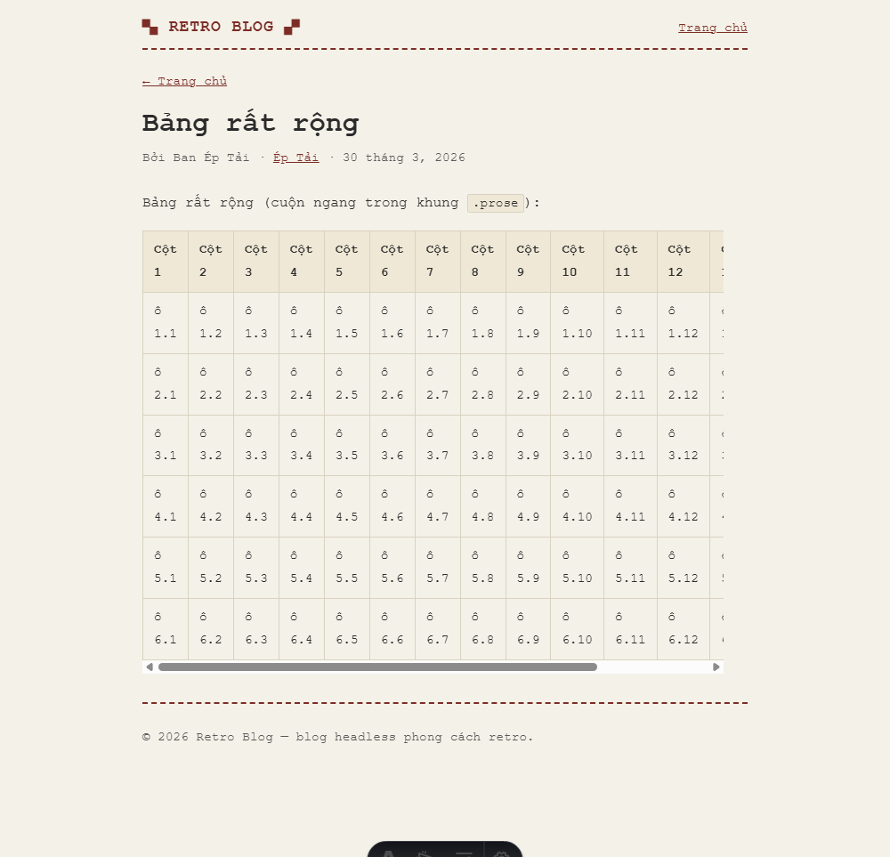
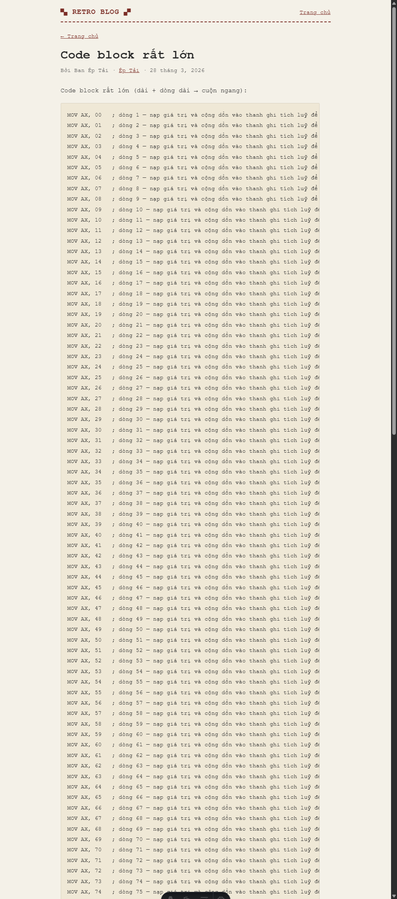
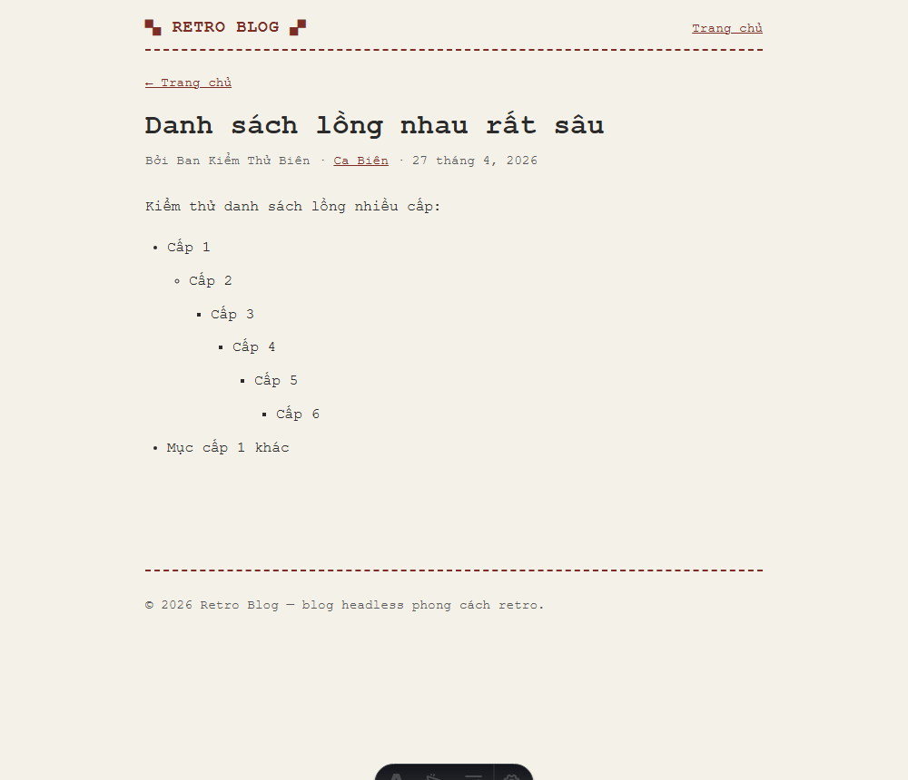
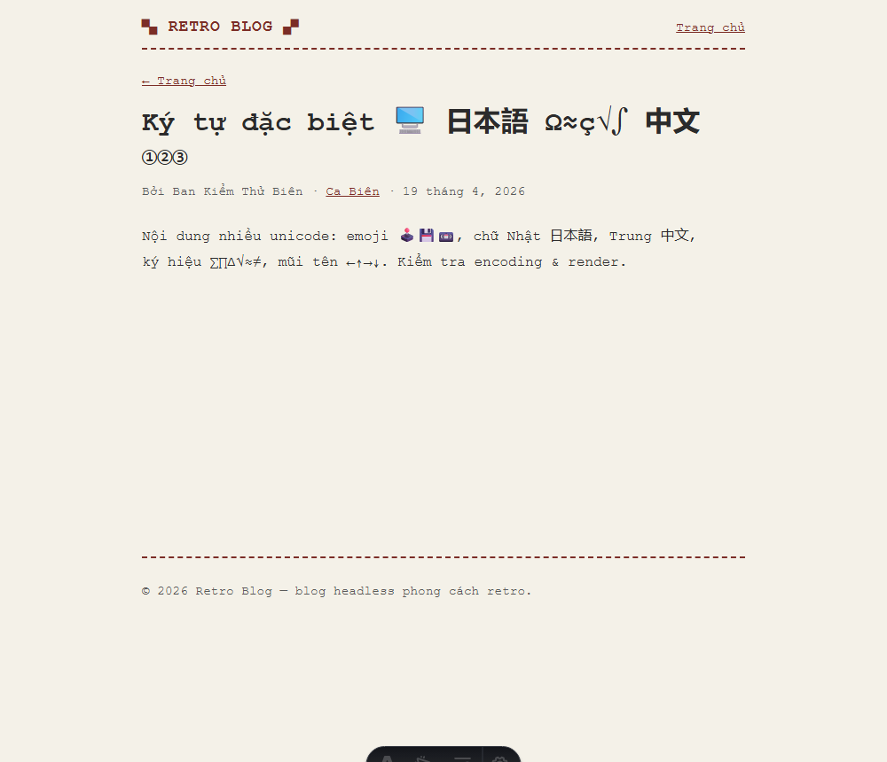
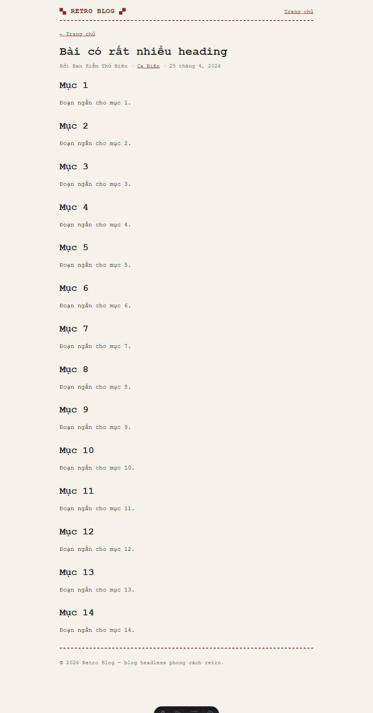
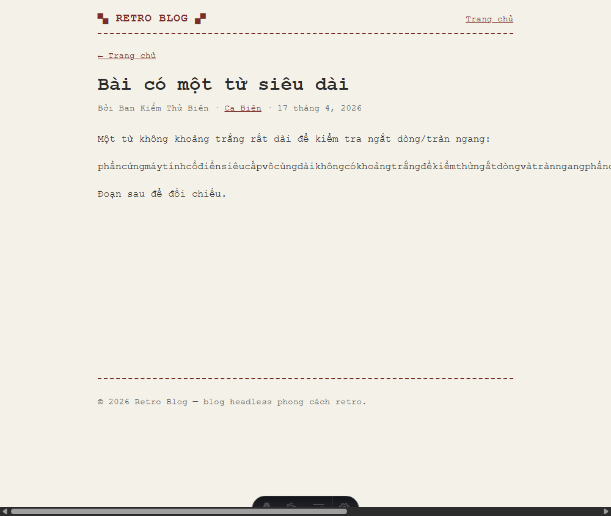

# Sprint 4 — Phase 4 (Dogfooding & Usability Verify) — Ảnh

Chụp `2026-07-22` từ `astro dev` (desktop 1000px), fixture edge/stress đã load.

| Ảnh | Ca | Kết luận |
|---|---|---|
|  | Bảng rất rộng (15 cột) | ✅ cuộn ngang **trong khung** `.prose`, trang không tràn |
|  | Code block rất lớn (160 dòng) | ✅ cuộn trong khung, đọc được |
|  | Nested list 6 cấp | ✅ thụt lề rõ, marker phân biệt |
|  | Unicode nặng (emoji/日本語/中文/∑∏∆/①②③) | ✅ render đúng, đọc tốt |
|  | 14 heading | ✅ phân cấp rõ |
|  | Từ siêu dài (≥100 ký tự) | ⚠️ **cuộn ngang trang** → Finding **UI-1** (Visual Backlog, không sửa Reader ở Sprint 4) |

Đo overflow (CDP @390 & desktop): mọi trang OK **trừ** `long-word`. Chi tiết: [sprint-4-completion-report §5-6](../../sprint-4.md).
